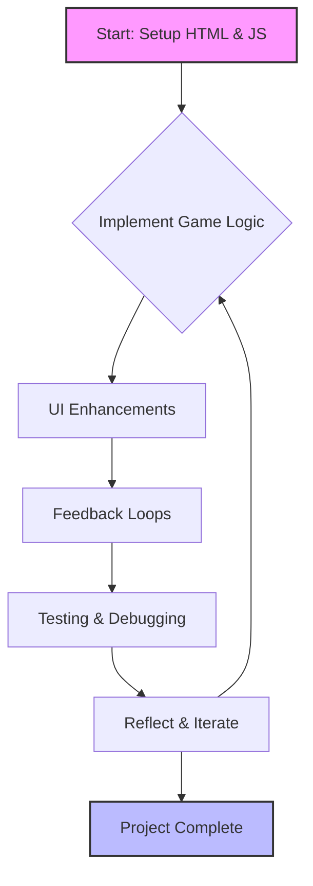

# Agile Setup for Rock-Paper-Scissors Game

This week, I applied **Agile principles** to the development of my Rock-Paper-Scissors browser game. While the project itself is small, using an Agile mindset allowed me to **organize work into iterative steps**, prioritize features, and reflect on user experience improvements at each stage.

---

## Iterative Development Process

I approached the project in **short, focused cycles**, each with a clear goal:

1. **Setup and Basic Functionality**  
   - Created the initial HTML structure with a canvas and interactive buttons.  
   - Implemented the core game logic for Rock-Paper-Scissors, allowing the player to choose options through the console.  

2. **UI Enhancements**  
   - Designed a visually engaging instructions panel with images and clear guidance.  
   - Added an "Inspect Me" button to encourage users to interact with the HTML and learn about the DOM.  

3. **Feedback Loops**  
   - Incorporated dynamic updates to the result box showing choices and outcomes.  
   - Highlighted selected images with visual effects to reinforce player actions.  

4. **Testing & Debugging**  
   - Played multiple rounds to check edge cases, such as invalid input or repeated selections.  
   - Adjusted styles and layout to improve clarity and usability.  

> *Reflection:* Breaking the project into small iterations made it easier to **identify issues early**, respond quickly, and refine the user experience without overwhelming complexity.

---

## Example Code Snippets

### HTML: Game Buttons and Result Display

```html
<!-- filepath: /home/saanv/student/assets/rps.html -->
<div id="game">
  <button onclick="play('rock')">🪨 Rock</button>
  <button onclick="play('paper')">📄 Paper</button>
  <button onclick="play('scissors')">✂️ Scissors</button>
  <div id="result"></div>
</div>
```

### JavaScript: Core Game Logic

```js
// filepath: /home/saanv/student/assets/rps.js
function play(playerChoice) {
  const choices = ['rock', 'paper', 'scissors'];
  const computerChoice = choices[Math.floor(Math.random() * 3)];
  let result = '';
  if (playerChoice === computerChoice) {
    result = "It's a tie!";
  } else if (
    (playerChoice === 'rock' && computerChoice === 'scissors') ||
    (playerChoice === 'paper' && computerChoice === 'rock') ||
    (playerChoice === 'scissors' && computerChoice === 'paper')
  ) {
    result = 'You win!';
  } else {
    result = 'You lose!';
  }
  document.getElementById('result').innerText =
    `You chose ${playerChoice}, computer chose ${computerChoice}. ${result}`;
}
```

---

## Agile Workflow Diagram



---

## Sprint Planning & Task Management

Even for a personal project, I treated each feature like a mini sprint:

- **User Story:** As a player, I want to see clear instructions and feedback so that I can play the game confidently.  
- **Tasks:**  
  - Build console commands to play Rock-Paper-Scissors  
  - Add visual highlights for selected choices  
  - Create a results display section  
  - Enable interactive encouragement to inspect HTML  

By keeping tasks small and focused, I could **measure progress after each cycle**, ensuring the game improved incrementally rather than trying to implement everything at once.

---

## Reflection on Agile & LxD

Applying Agile methodology to this project provided several insights:

- **Iteration supports learning:** Repeated cycles of coding, testing, and refining made the game more intuitive and engaging.  
- **Prioritizing user experience:** Focusing on feedback loops and visual cues ensured that the game was accessible and enjoyable.  
- **Flexibility:** Agile allowed me to change priorities on the fly, such as emphasizing visual highlights over additional console commands when I realized they enhanced user understanding.  

> *Takeaway:* Even small projects benefit from an Agile mindset. Iterative development, short feedback loops, and responsive adjustments make coding not just functional, but **user-focused and engaging**, mirroring real-world LxD practices.

---

Overall, the Agile setup helped me **balance development efficiency with thoughtful design**, resulting in a Rock-Paper-Scissors game that is both functional and enjoyable for users